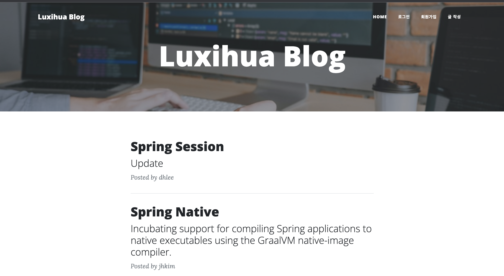

# Simple Blog 개발
> 간단한 CRUD 기능을 지원하는 개인 블로그를 개발

   
  
   

 

## 설명

SpringBoot Framework을 활용하여 간단한 블로그를 제작하였고, 비교적 쉽게 데이터베이스를 다루기 위한 엔진으로 MyBatis을 연동하여 사용하였다.
Maven을 사용하여 의존성 관리와 스프링 설정을 진행하였다.

MyBatis를 처음 활용하면서 진행하였기에 간단한 쿼리문 기반의 기본적인 CRUD 기능만을 구현할 수 밖에 없었다.

Controller, Service, mapper 등의 자세한 구현 로그는 각각의 패키지 내 readme.md 파일에서 확인 가능하다. 

 

## 기술 스택

- Spring
- Mustache
- Javascript

| Spring | Mustache | Javascript   |  h2   |
| :--------: | :--------: | :------: | :-----: |
|   ![spring]    |   ![Mustache]    | ![js] | ![h2] |

 

## 구현 기능

### 기능 1

    - 메인 페이지 목록 리스트 페이징 기능 추가 및 '더보기' 구현
    

    
### 기능 2

    - 글 상세 보기 구현
    

### 기능 3

    - 글 작성 및 추가 기능 구현
    
    
### 기능 4

    - 글 수정 기능 구현
    
    

## 업데이트 내역

    - 회원가입, 로그인 기능 추가 예정
    - 글 삭제 기능 추가 예정

 

## 라이센스

codepresso &copy; [codepresso]

<!-- Stack Icon Refernces -->

[spring]: ./rd_images/spring.png
[Mustache]: ./rd_images/mustache.png
[js]: ./rd_images/javascript.png
[h2]: ./rd_images/h2.png

